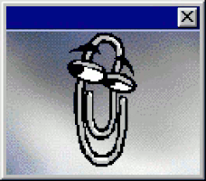

  

    <h2 align="center"><code>beatriz@github:~$ whoami</code></h2>
    
    meu nome é Beatriz, atualmente estou cursando engenharia de software na UFMS e estou na área de devops/infraestrutura, estou na fase de fazer projetos de programação, obter experiência              de mercado e focar na faculdade
  

 

## linguagens e tecnologias 

### front-end
  

### back-end
      

### testes

      
### infraestrutura
   
  
### ferramentas
  

## projetos em destaque

### quadro a quadro
Sistema web de gerenciamento interno de cinema, desenvolvido como projeto acadêmico para a disciplina de Programação Web. Permite o controle de filmes, salas e sessões, com autenticação e controle de acesso por perfil de usuário.

 

🔗 [ver repositório](https://github.com/biavieirakkj/quadro-a-quadro)

### controle de gastos
Aplicação web para controle de gastos pessoais, criada para fins de estudo, com autenticação via Firebase e validações de formulário.

 

🔗 [ver repositório](https://github.com/biavieirakkj/controle-gastos)

